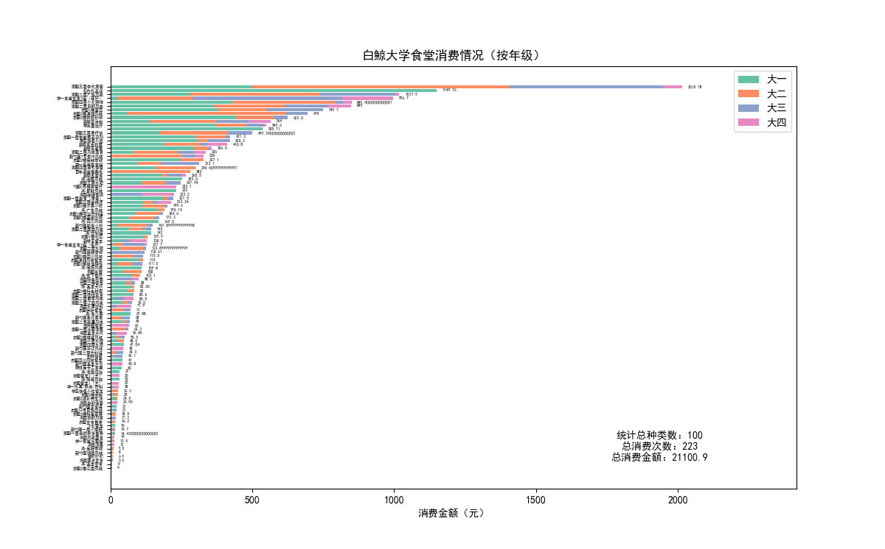
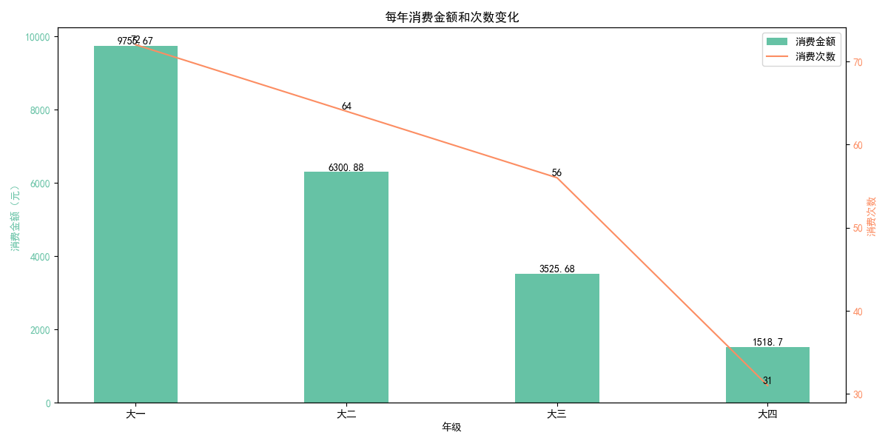

# PKU-Annual-Eat-Semior

这程序对大四比较友好，未充分考虑到其他年级，见谅（其他年级也可以正常使用，不过可能标注有些偏差）

## 简介

> 项目的 idea 来源于 [Rose-max111](https://github.com/Rose-max111)，经过[KingRayCao](https://github.com/KingRayCao)适配白鲸食堂，我在此基础上略微加了点代码。

> 项目fork自[PKU-Annual-Eat](https://github.com/KingRayCao/PKU-Annual-Eat?tab=readme-ov-file)

这是一个 Python 脚本，用于分析白鲸大学校园卡消费数据。它可以从学校的服务器获取你的消费记录，并生成两个图表：

1. **按年级和商家划分的消费柱状图**：显示每个窗口在不同年级的消费金额（横向累积）。
   
2. **每年消费金额和次数变化图**：显示从大一到大四，每年的消费金额和次数变化情况，其中金额用柱状图表示，次数用折线图表示。
   


## 如何使用

1. **安装依赖库**

   确保你已安装 Python 3.6 或更高版本。然后，使用 pip 安装必要的库：

   ```bash
   pip install matplotlib requests
   ```
2. **配置文件 `config.json`**

### 0. 获取account和hallticket

首先，登录校园卡账号后，在[白鲸大学校园卡网站](https://card.pku.edu.cn/user/user)获取你的 `account`和 `hallticket`。方法如下：


点击 `账号管理`，在弹出的页面中找到 `账号`，复制其值。


`F12` 打开开发者工具，切换到 `Network`标签页，然后 `Ctrl+R`刷新页面，找到 `GetCardInfoByAccountNoParm` 这个请求，进入 `Cookies`选项卡，复制其中 `hallticket`字段的**value**，后面会用到。


   首次运行脚本时，如果当前目录下没有 `config.json` 文件，程序会提示你输入你的 `account` 和 `hallticket`。程序会将你输入的信息保存在 `config.json` 文件中，以便下次使用。请确保你的 `hallticket` 是有效的，否则程序可能无法获取数据。

   `config.json` 文件的示例如下:

   ```json
   {
       "account": "your_account",
       "hallticket": "your_hallticket"
   }
   ```
3. **运行脚本**

   在终端或命令提示符中，导航到脚本所在的目录，然后运行：

   ```bash
   python main.py
   ```
4. **查看结果**

   脚本运行后，会在当前目录下生成以下文件：

   * `result.png`：按年级和商家划分的消费柱状图。
   * `trend.png`：每年消费金额和次数变化图。
   * `temp/` 文件夹，用于存储缓存数据，会加速后续运行
5. **日期范围**

   程序会默认从 2021-08-01 到 2024-12-31 的所有数据，若需要修改默认时间，请修改程序中的 `default_sdate`和 `default_edate`变量的值

## 注意事项

* 请确保你的 `hallticket` 是有效的，否则程序无法获取数据。
* 数据会缓存到本地 `temp/` 文件夹下，下次运行会直接使用缓存。
* 如果程序出现错误，请检查终端输出的错误信息，并确保你的网络连接正常。

## LICENSE

除非另有说明，本仓库的内容采用 [CC BY-NC-SA 4.0](https://creativecommons.org/licenses/by-nc-sa/4.0/) 许可协议。在遵守许可协议的前提下，您可以自由地分享、修改本文档的内容，但不得用于商业目的。

如果您认为文档的部分内容侵犯了您的合法权益，请联系项目维护者，我们会尽快删除相关内容。